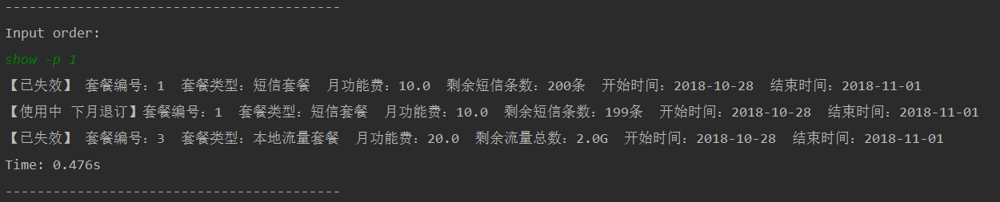

# 说明文档

[TOC]


## 1 项目结构

基础架构：Maven+Mysql

项目采用DAO设计模式。项目架构如下所示：


Main.java中列出了所有操作的调用。

dao层：操作实现的接口

- BillDao：账单相关操作的接口
- OrderDao：套餐相关操作的接口，如订购退订等
- PackageDao：标准套餐操作相关的接口，如创建套餐。
- UserDao：客户相关操作的接口，如注册客户以及打电话、发短信和使用流量等

dao.impl层：dao接口的实现

domain层：接口调用的具体对象

until.db层：数据库的连接和调用

## 2 操作说明

运行Main.java之后，所有操作都可以通过在控制台输入命令的方式来调用。

### 2.1 基础操作

基础操作指未在需求操作列表内的、但对需求操作有辅助或前提作用的操作。

#### 2.1.1 注册客户

命令

```bash
register [user](name, balance, location, phone)

# name   	[String]客户姓名
# balance	[double]账户余额
# location	[String]号码归属地
# phone  	[String]手机号码
```

实例


API


#### 2.1.2 创建新的套餐

命令

```bash
create [package](name, msg_num,call_num, flow_num, pay, mop, cop, fop, location, time)

# name   	[String]套餐名称
# msg_num	[int]套餐内所含的最多可以发送的短信条数，单位：条
# call_num	[int]最多可以拨打的电话时长，单位：分钟
# flow_num	[int]最多可以使用的流量数，单位：K/M/G
# pay     	[double]月功能费
# mop     	[double]发送短信超出条数的价格，单位：元/条
# cop     	[double]拨打电话超出时间的价格，单位：元/分钟
# fop     	[double]使用流量超出数量的价格，单位：元/M
# locaiton	[String]套餐归属地
# time    	[String]套餐时长（可以是月套餐，也可以是一日无限包、十日流量包等短期套餐包）
#			time的格式："0.0.0"    从左到右分别表示年、月、日数

# 在以上选项中，必填选项为name, pay, location, timeLen。其余选项可视情况添加。
# 如果某一项不填，其前后的区分符逗号不能不填。
# 实例： create package(短信套餐, 200, , , 10, 0.1, , ,江苏省, 0.1.0)
```

实例


API


#### 2.1.3 列出所有客户

命令

```
show -u
```

实例


API


#### 2.1.4 列出已创建的所有套餐

命令

```
show -p
```

实例


API


### 2.2 需求操作

#### 2.2.1 客户套餐查询（包括历史记录） 

命令

```bash
show -p uid
show -p -n username
# uid	    客户编号
# username	客户姓名
```

实现逻辑

> 客户套餐保存在orders表中

实例：


API


#### 2.2.2 客户月账单生成

命令

```bash
show -b uid [month]
# uid  		客户编号
# month		默认生成本月的月账单，如输入了month，则生成指定月份的月账单。
```

实现逻辑

> 月账单内容包括月消费、账户余额、本月订购套餐等。月消费、账户余额的信息保存在bills表中，本月订购套餐从orders表中获取。

实例：


API


#### 2.2.3 订购套餐

命令

```bash
order uid pid [next]
# uid	客户编号
# pid	套餐编号
# next	默认从本月开始订购，加上next表示从下月开始订购
```

实现逻辑

> 如果是立即订购的话，从本日开始到下一月第一天之前，也算作“一个月”。这意味着，如果套餐时限是一个月的话，那么如果在今天订购的话，其到下一个月1号前就终止了。
>
> 系统会判断此客户当前想要订购的套餐是否在**同一时间**内有重合，如果有的话，将不能再次订购。
>
> 如果客户的账户余额不足以抵上功能费，将不能激活套餐。
>
> 如果是下一个月订购，开始时间就是下一个月一号。套餐月功能费将在下一个1号扣去。（如果此时账户余额不足以抵上功能费，将不能激活套餐）

实例：


API


#### 2.2.4 退订套餐

命令

```bash
unsub uid pid [next]
# uid	客户编号
# pid	套餐编号
# next	默认从本月开始退订，加上next表示从下月开始退订
```

实现逻辑

> 如果是立即退订的话，套餐将会从此刻开始立即失效。本月立即退订的套餐其功能费不会被退回。
>
> 如果是从下月退订的话，此套餐将会被标记为下月退订，并不会扣除月功能费。
>
> 失效的套餐将会被识别，在之后的相关操作中不会再被调用到。

实例

立即退订


下月退订


 

API


#### 2.2.5 用户通话资费生成

命令

```bash
call uid minutes
# uid    	客户编号
# minutes	电话拨打的时长（单位：分钟）
```

实现逻辑

> 首先判断是否有套餐包含电话时长。如果有的话，先从这些套餐里减去时长。
>
> 如果套餐内时长少于电话拨打时长，那么再根据套餐的超出价格计算超出部分的金额
>
> （如果有多个套餐都规定了超出价格的话，那么选其最小值用于计算）
>
> 如果没有可以使用的套餐，那么按照0.5元/分钟的价格来计费。

实例


API


#### 2.2.6 用户使用流量资费生成

命令

```bash
surf uid num [locaiton]
# uid	客户编号
# num	使用的流量数量（单位可以是G/M/K)
# location	当前使用流量的地区（默认为本地，如果是在外省，将会使用国内流量）
```

实现逻辑：

> 首先判断是否有套餐包含流量。如果有的话，先从这些套餐里减去流量。
>
> 如果套餐内流量少于于所使用的流量，那么再根据套餐的超出价格计算超出部分的金额
>
> （如果有多个套餐都规定了超出价格的话，那么选其最小值用于计算）
>
> 如果没有可以使用的套餐，那么按照本地流量价格0.3元/M、国内流量价格0.4元/M的价格来计费。

实例


API


## 3 数据库E-R图


## 4 优化思路

